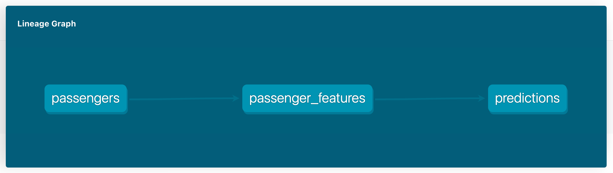

# Predicting Titanic Survivals in DBT Dag

In this tutorial, we will see how to build an end to end ML pipeline with opensource [Layer DBT Adapter](https://github.com/layerai/dbt-adapters). We will:



- Build a DBT model to build our training data called `passenger_features`
- Next, we will build another DBT model which uses `passenger_features` model to predict the survivals of the Titanic passengers.

```sql
select id,
       review,
       layer.predict("layer/nlptown/models/sentimentanalysis", ARRAY[review])
from {{ref('reviews')}}
```

## How to run

First install the open-source [Layer DBT Adapter](https://github.com/layerai/dbt-adapters). Right now, we only support Bigquery (more to come soon)

```shell
pip install dbt-layer-bigquery -U -q
```

Add a new bigquery profile to your [DBT profile](https://docs.getdbt.com/dbt-cli/configure-your-profile/). Name it as `layer-profile`, and don't forget to set `type: layer_bigquery` for Layer to work. Here is a sample profile:


```yaml
layer-profile:
  target: dev
  outputs:
    dev:
      type: layer_bigquery
      method: service-account
      project: [GCP project id]
      dataset: [the name of your dbt dataset]
      threads: [1 or more]
      keyfile: [/path/to/bigquery/keyfile.json]
```

Clone this repo:
```shell
git clone https://github.com/layerai/examples-dbt
cd titanic
```

And seed the sample [reviews table](seeds/reviews.csv) which includes random multi-language product reviews from Amazon.

```shell
dbt seed
```

And finally you can run the project:

```shell
dbt run
```


## Model

In this DBT example, we use a pretrained machine learning model from Layer. This model was trained on Titanic passengers data from Kaggle and can be used the predict the survivals of the Titanic disaster.

To learn more about this machine learning model:

https://app.layer.ai/layer/titanic